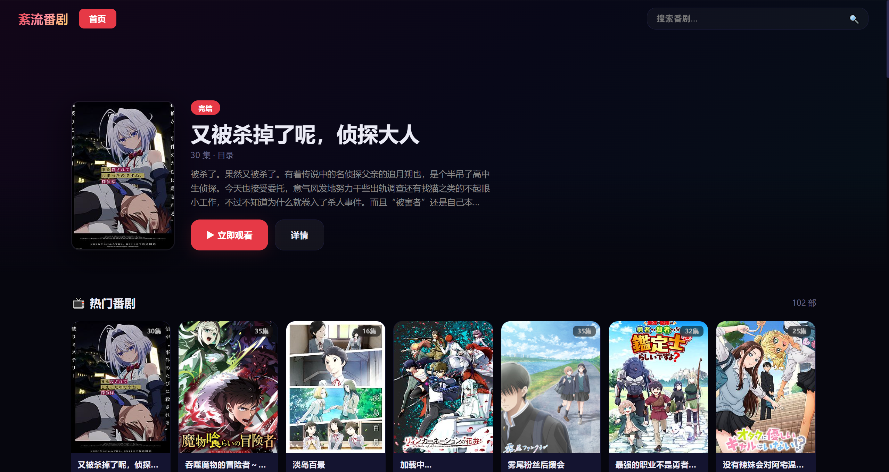

# 🌀 紊流番剧

> 本地运行的动漫追番工具，数据实时来源于 AGE 动漫站

[](https://python.org)
[](https://fastapi.tiangolo.com)
[](LICENSE)



## ✨ 功能特性

| 功能 | 说明 |
|------|------|
| 🔍 **智能搜索** | 按关键词搜索动漫，实时对接 AGE 动漫搜索接口 |
| 📺 **首页浏览** | 聚合 AGE 动漫最新上架内容，瀑布流展示 |
| 📋 **详情页** | 封面、简介、标签、集数一览，显示完结/连载状态 |
| 🎬 **在线播放** | 内嵌 iframe 播放，支持 MP4 和 M3U8/HLS 格式 |
| 💡 **相似推荐** | 基于标签相似度在详情页推荐关联番剧 |
| ⌨️ **快捷键** | ESC 快速关闭弹窗 |

## 🚀 快速开始

### 环境要求

- Python 3.8+
- Windows / macOS / Linux

### 安装运行

```bash
# 克隆仓库
git clone https://github.com/wenliu3/wenliufanju.git
cd wenliufanju

# 安装依赖
pip install -r requirements.txt

# 启动服务
python app.py
```

或 Windows 用户直接双击 `启动.bat`

启动后自动打开浏览器访问 `http://localhost:18888`

## 🛠️ 技术栈

- **后端**: FastAPI + Uvicorn
- **前端**: 原生 HTML5 / CSS3 / JavaScript
- **播放**: HTML5 Video + hls.js
- **数据**: 实时抓取 AGE 动漫站（无需本地数据库）

## 📡 API 接口

| 接口 | 方法 | 说明 |
|------|------|------|
| `/api/search?q=xxx` | GET | 搜索动漫 |
| `/api/detail/{id}` | GET | 动漫详情 + 剧集列表 |
| `/api/play?ep=xxx` | GET | 获取播放地址 |
| `/api/recommend?aid=xxx` | GET | 相似推荐 |

## 📁 项目结构

```
wenliufanju/
├── app.py              # 后端入口（FastAPI）
├── static/
│   └── index.html      # 前端页面（单文件）
├── data/
│   └── anime.json      # 本地数据缓存
├── requirements.txt    # Python 依赖
├── 启动.bat             # Windows 一键启动
└── README.md
```

## ⚠️ 免责声明

本项目仅供学习交流使用，所有动漫数据来源于 [AGE 动漫](https://www.agedm.io)，版权归原著作权人所有。请勿用于商业用途。

## 📄 License

[MIT](LICENSE) © wenliu3
